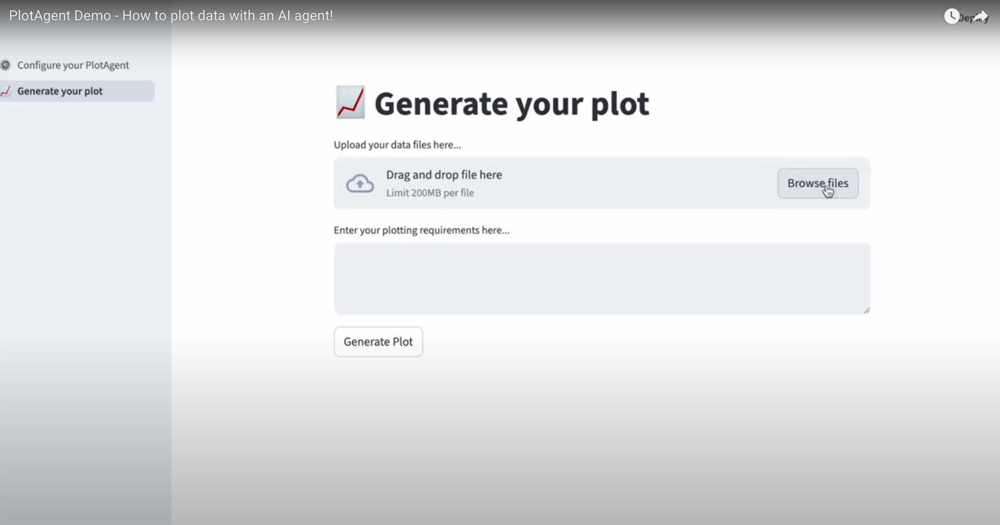

# Plot-Agent

Plot-Agent is a Python package designed to help you create plots and data visualisations in an easy way.
It provides a simple interface for generating, saving, and managing plot data, making it easier to work with visualizations in your projects.

## Table of Contents

- [Plot-Agent](#plot-agent)
  - [Table of Contents](#table-of-contents)
  - [Installation](#installation)
  - [Usage](#usage)
  - [Contributing](#contributing)
  - [License](#license)

## Installation

...

## Usage

The following video demonstrates how to use Plot-Agent to create a simple plot:

